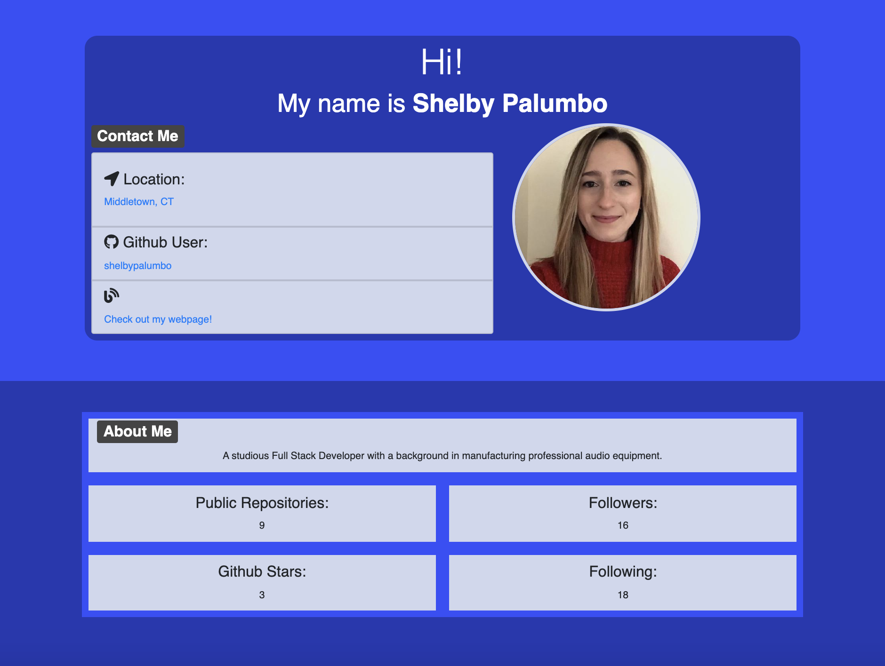

# Developer-Profile-Generator

Dynamically generates a PDF developer profile page from the data given by a GitHub username.
https://shelbypalumbo.github.io/Developer-Profile-Generator/

## User Story

As a product manager, I want a developer profile generator, so that I can easily gather and provide a resume on a specific developer.

## Usage

Upon start of the application, a prompt will appear for users to enter a github username and their favorite color. Once both prompts are answered, the html and pdf file will generate, and a confirmation message will appear!

### Generated Profile Example

## Technologies Used

- HTML
- CSS
- Javascript
- Puppeteer

### Additional Styling Framework

- Bootstrap | https://getbootstrap.com/
- Fontawesome icons | https://fontawesome.com/icons?d=gallery&m=free
